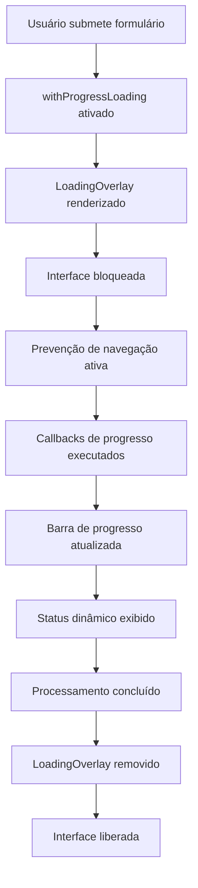

# 🔄 Sistema de Loading Bloqueante - Documentação Completa

## 🎯 Visão Geral

Sistema avançado de **loading bloqueante** desenvolvido para os formulários da Casa da Gráfica, fornecendo **feedback visual profissional** durante o processamento de dados e **prevenção total de navegação acidental** durante operações críticas.

## 🏗️ Arquitetura do Sistema

### **Componentes Principais**

```
src/
├── components/common/
│   └── LoadingOverlay.jsx          # Componente de overlay bloqueante
├── hooks/
│   └── useFormLoading.js           # Hook de gerenciamento de loading
├── services/
│   └── formularioService.js        # Service com callbacks de progresso
└── index.css                       # Animações CSS profissionais
```

### **Fluxo de Funcionamento**


```mermaid
graph TD
    A[Usuário submete formulário] --> B[withProgressLoading ativado]
    B --> C[LoadingOverlay renderizado]
    C --> D[Interface bloqueada]
    D --> E[Prevenção de navegação ativa]
    E --> F[Callbacks de progresso executados]
    F --> G[Barra de progresso atualizada]
    G --> H[Status dinâmico exibido]
    H --> I[Processamento concluído]
    I --> J[LoadingOverlay removido]
    J --> K[Interface liberada]
```

## 🎭 LoadingOverlay Component

### **Implementação Completa**

```jsx
// components/common/LoadingOverlay.jsx
import React, { useEffect } from 'react';

const LoadingOverlay = ({ 
  isLoading, 
  message = 'Processando...', 
  submessage = '',
  progress = 0, 
  showProgress = false,
  variant = 'professional'
}) => {
  useEffect(() => {
    if (!isLoading) return;

    // ✅ Prevenir teclas de navegação
    const handleKeyDown = (e) => {
      // Bloquear F5, Ctrl+R, Alt+F4
      if (e.key === 'F5' || 
          (e.ctrlKey && e.key === 'r') || 
          (e.altKey && e.key === 'F4')) {
        e.preventDefault();
        e.stopPropagation();
        return false;
      }
    };

    // ✅ Prevenir navegação pelo botão voltar/reload
    const handleBeforeUnload = (e) => {
      e.preventDefault();
      e.returnValue = 'Operação em andamento. Tem certeza que deseja sair?';
      return e.returnValue;
    };

    // ✅ Prevenir navegação pelo histórico
    const handlePopState = (e) => {
      e.preventDefault();
      window.history.pushState(null, '', window.location.href);
    };

    // Adicionar event listeners
    document.addEventListener('keydown', handleKeyDown, true);
    window.addEventListener('beforeunload', handleBeforeUnload);
    window.addEventListener('popstate', handlePopState);
    
    // Adicionar estado ao histórico para prevenir voltar
    window.history.pushState(null, '', window.location.href);

    // Cleanup
    return () => {
      document.removeEventListener('keydown', handleKeyDown, true);
      window.removeEventListener('beforeunload', handleBeforeUnload);
      window.removeEventListener('popstate', handlePopState);
    };
  }, [isLoading]);

  if (!isLoading) return null;

  return (
    <div className="loading-overlay">
      <div className="loading-backdrop" />
      
      <div className="loading-content">
        {/* Spinner Animado */}
        <div className={`loading-spinner ${variant}`}>
          <div className="spinner-ring"></div>
          <div className="spinner-ring"></div>
          <div className="spinner-ring"></div>
        </div>

        {/* Mensagem Principal */}
        <div className="loading-message">
          <h3>{message}</h3>
          {submessage && (
            <p className="loading-submessage">{submessage}</p>
          )}
        </div>

        {/* Barra de Progresso */}
        {showProgress && (
          <div className="progress-container">
            <div className="progress-bar">
              <div 
                className="progress-bar-fill"
                style={{ width: `${Math.min(progress, 100)}%` }}
              />
            </div>
            <div className="progress-text">
              {Math.round(progress)}%
            </div>
          </div>
        )}

        {/* Aviso de não fechar */}
        <div className="loading-warning">
          ⚠️ Não feche esta janela nem atualize a página
        </div>
      </div>
    </div>
  );
};

export default LoadingOverlay;
```

### **Props do Componente**

| Prop | Tipo | Default | Descrição |
|------|------|---------|-----------|
| `isLoading` | `boolean` | `false` | Controla se o overlay está visível |
| `message` | `string` | `'Processando...'` | Mensagem principal exibida |
| `submessage` | `string` | `''` | Submensagem opcional |
| `progress` | `number` | `0` | Progresso de 0 a 100 |
| `showProgress` | `boolean` | `false` | Se deve exibir a barra de progresso |
| `variant` | `string` | `'professional'` | Variante de estilo |

## 🪝 useFormLoading Hook

### **Implementação Completa**

```javascript
// hooks/useFormLoading.js
import { useState, useCallback } from 'react';

const useFormLoading = () => {
  const [isLoading, setIsLoading] = useState(false);
  const [loadingMessage, setLoadingMessage] = useState('');
  const [loadingSubmessage, setLoadingSubmessage] = useState('');
  const [progress, setProgress] = useState(0);

  // ✅ Função para executar operações com loading
  const withProgressLoading = useCallback(async (operation) => {
    setIsLoading(true);
    setProgress(0);
    setLoadingMessage('Iniciando processamento...');
    setLoadingSubmessage('');

    try {
      // Callbacks para atualizar progresso
      const updateProgress = (newProgress) => {
        setProgress(Math.min(newProgress, 100));
      };

      const updateStatus = (message, submessage = '') => {
        setLoadingMessage(message);
        setLoadingSubmessage(submessage);
      };

      // Executar a operação com os callbacks
      const result = await operation(updateProgress, updateStatus);
      
      // Finalização
      updateProgress(100);
      updateStatus('Processamento concluído!', 'Redirecionando...');
      
      // Aguardar um pouco para mostrar conclusão
      await new Promise(resolve => setTimeout(resolve, 1000));
      
      return result;

    } catch (error) {
      setLoadingMessage('Erro no processamento');
      setLoadingSubmessage(error.message || 'Tente novamente');
      
      // Aguardar um pouco para mostrar o erro
      await new Promise(resolve => setTimeout(resolve, 2000));
      
      throw error;
    } finally {
      resetLoading();
    }
  }, []);

  // ✅ Função para resetar estado
  const resetLoading = useCallback(() => {
    setIsLoading(false);
    setLoadingMessage('');
    setLoadingSubmessage('');
    setProgress(0);
  }, []);

  // ✅ Função para loading simples sem progresso
  const withSimpleLoading = useCallback(async (operation, message = 'Carregando...') => {
    setIsLoading(true);
    setLoadingMessage(message);
    setProgress(0);

    try {
      const result = await operation();
      return result;
    } catch (error) {
      setLoadingMessage('Erro no processamento');
      setLoadingSubmessage(error.message || 'Tente novamente');
      await new Promise(resolve => setTimeout(resolve, 2000));
      throw error;
    } finally {
      resetLoading();
    }
  }, []);

  return {
    // Estados
    isLoading,
    loadingMessage,
    loadingSubmessage,
    progress,
    
    // Funções de controle
    withProgressLoading,
    withSimpleLoading,
    resetLoading,
    
    // Funções de atualização manual
    setIsLoading,
    setLoadingMessage,
    setLoadingSubmessage,
    setProgress
  };
};

export default useFormLoading;
```

### **Métodos do Hook**

| Método | Descrição | Uso |
|--------|-----------|-----|
| `withProgressLoading()` | Executa operação com progresso | Para envio de formulários |
| `withSimpleLoading()` | Loading simples sem progresso | Para operações rápidas |
| `resetLoading()` | Reseta todos os estados | Limpar estado manualmente |

## 🎨 Animações CSS Profissionais

### **Estilos Completos**

```css
/* index.css - Animações do Loading */

/* ✅ Overlay principal */
.loading-overlay {
  position: fixed;
  top: 0;
  left: 0;
  right: 0;
  bottom: 0;
  z-index: 999999;
  display: flex;
  align-items: center;
  justify-content: center;
  animation: fadeInOverlay 0.4s ease-out;
}

/* ✅ Backdrop com blur */
.loading-backdrop {
  position: absolute;
  top: 0;
  left: 0;
  right: 0;
  bottom: 0;
  background: rgba(0, 0, 0, 0.85);
  backdrop-filter: blur(8px);
  -webkit-backdrop-filter: blur(8px);
}

/* ✅ Container do conteúdo */
.loading-content {
  position: relative;
  z-index: 1;
  background: linear-gradient(135deg, rgba(255, 255, 255, 0.95), rgba(255, 255, 255, 0.9));
  padding: 40px;
  border-radius: 20px;
  text-align: center;
  box-shadow: 
    0 25px 50px rgba(0, 0, 0, 0.25),
    0 0 0 1px rgba(255, 255, 255, 0.2);
  animation: fadeInScale 0.5s ease-out;
  max-width: 400px;
  width: 90%;
}

/* ✅ Spinner com anéis */
.loading-spinner {
  position: relative;
  width: 80px;
  height: 80px;
  margin: 0 auto 30px;
}

.spinner-ring {
  position: absolute;
  top: 0;
  left: 0;
  width: 100%;
  height: 100%;
  border: 3px solid transparent;
  border-radius: 50%;
  animation: spinRing 1.5s cubic-bezier(0.68, -0.55, 0.265, 1.55) infinite;
}

.spinner-ring:nth-child(1) {
  border-top-color: #3b82f6;
  animation-delay: 0s;
}

.spinner-ring:nth-child(2) {
  border-right-color: #8b5cf6;
  animation-delay: 0.3s;
}

.spinner-ring:nth-child(3) {
  border-bottom-color: #06d6a0;
  animation-delay: 0.6s;
}

/* ✅ Mensagens */
.loading-message h3 {
  margin: 0 0 10px;
  color: #1f2937;
  font-size: 20px;
  font-weight: 600;
}

.loading-submessage {
  margin: 0;
  color: #6b7280;
  font-size: 14px;
  opacity: 0.8;
}

/* ✅ Barra de progresso */
.progress-container {
  margin: 25px 0 20px;
}

.progress-bar {
  width: 100%;
  height: 8px;
  background: rgba(0, 0, 0, 0.1);
  border-radius: 10px;
  overflow: hidden;
  margin-bottom: 8px;
}

.progress-bar-fill {
  height: 100%;
  background: linear-gradient(90deg, #3b82f6, #8b5cf6, #06d6a0);
  background-size: 200% 100%;
  border-radius: 10px;
  transition: width 0.3s ease;
  animation: shimmer 2s infinite;
}

.progress-text {
  font-size: 12px;
  color: #6b7280;
  font-weight: 600;
}

/* ✅ Aviso */
.loading-warning {
  margin-top: 20px;
  padding: 12px;
  background: rgba(251, 191, 36, 0.1);
  border: 1px solid rgba(251, 191, 36, 0.3);
  border-radius: 8px;
  color: #92400e;
  font-size: 12px;
  font-weight: 500;
}

/* ✅ Keyframes */
@keyframes fadeInOverlay {
  from {
    opacity: 0;
  }
  to {
    opacity: 1;
  }
}

@keyframes fadeInScale {
  from {
    opacity: 0;
    transform: scale(0.9) translateY(20px);
  }
  to {
    opacity: 1;
    transform: scale(1) translateY(0);
  }
}

@keyframes spinRing {
  0% {
    transform: rotate(0deg);
  }
  100% {
    transform: rotate(360deg);
  }
}

@keyframes shimmer {
  0% {
    background-position: -200% 0;
  }
  100% {
    background-position: 200% 0;
  }
}

/* ✅ Responsividade */
@media (max-width: 768px) {
  .loading-content {
    padding: 30px 20px;
    margin: 20px;
  }
  
  .loading-spinner {
    width: 60px;
    height: 60px;
  }
  
  .loading-message h3 {
    font-size: 18px;
  }
}
```

## 🚀 Integração com FormularioService

### **Service com Callbacks de Progresso**

```javascript
// services/formularioService.js
export async function submitFormulario(formData, pdfFiles = [], onProgress = null, onStatusUpdate = null) {
  try {
    // ✅ Etapa 1: Validação inicial (0-10%)
    onProgress?.(5);
    onStatusUpdate?.('Validando dados do formulário...', 'Verificando campos obrigatórios');
    
    const validation = validateFormData(formData, pdfFiles);
    if (!validation.isValid) {
      throw new Error(`Dados inválidos: ${validation.errors.join(', ')}`);
    }
    
    onProgress?.(10);

    // ✅ Etapa 2: Processamento de PDFs (10-30%)
    onStatusUpdate?.('Processando arquivos PDF...', 'Convertendo arquivos para envio');
    onProgress?.(15);

    const processedPdfs = await Promise.all(
      pdfFiles.map(async (pdf, index) => {
        onProgress?.(15 + (index * 5));
        onStatusUpdate?.(`Processando ${pdf.name}...`, `Arquivo ${index + 1} de ${pdfFiles.length}`);
        
        return await convertToBase64(pdf.file);
      })
    );

    onProgress?.(30);

    // ✅ Etapa 3: Preparação de dados (30-40%)
    onStatusUpdate?.('Preparando dados para envio...', 'Organizando informações');
    
    const payload = {
      ...formData,
      pdfs: processedPdfs.map((base64, index) => ({
        nome: pdfFiles[index].name,
        tamanho: pdfFiles[index].size,
        tipo: pdfFiles[index].file.type,
        base64: base64
      }))
    };

    onProgress?.(40);

    // ✅ Etapa 4: Envio para servidor (40-80%)
    onStatusUpdate?.('Enviando para o servidor...', 'Aguarde, não feche a página');
    onProgress?.(45);

    const response = await fetch('/api/formularios', {
      method: 'POST',
      headers: {
        'Content-Type': 'application/json',
      },
      credentials: 'include', // ✅ Cookies HTTPOnly
      body: JSON.stringify(payload)
    });

    onProgress?.(70);

    // ✅ Etapa 5: Processamento da resposta (80-100%)
    onStatusUpdate?.('Processando resposta...', 'Finalizando operação');
    
    if (!response.ok) {
      const errorData = await response.json();
      throw new Error(errorData.mensagem || 'Erro no servidor');
    }

    const result = await response.json();
    onProgress?.(90);

    onStatusUpdate?.('Formulário enviado com sucesso!', 'Redirecionando...');
    onProgress?.(100);

    return {
      success: true,
      data: result,
      message: 'Formulário enviado com sucesso!'
    };

  } catch (error) {
    console.error('Erro ao enviar formulário:', error);
    
    onStatusUpdate?.('Erro no processamento', error.message);
    onProgress?.(0);
    
    throw error;
  }
}
```

## 🎯 Uso Prático nos Formulários

### **Exemplo Completo de Integração**

```jsx
// pages/formularios/ZeroHum.jsx
import React, { useState } from 'react';
import LoadingOverlay from '../../components/common/LoadingOverlay';
import useFormLoading from '../../hooks/useFormLoading';
import { submitFormulario } from '../../services/formularioService';

function ZeroHum() {
  const [formData, setFormData] = useState({});
  const [pdfFiles, setPdfFiles] = useState([]);
  
  // ✅ Hook de loading
  const {
    isLoading,
    loadingMessage,
    loadingSubmessage,
    progress,
    withProgressLoading
  } = useFormLoading();

  // ✅ Função de envio
  const handleSubmit = async () => {
    try {
      await withProgressLoading(async (updateProgress, updateStatus) => {
        const result = await submitFormulario(
          formData, 
          pdfFiles, 
          updateProgress, 
          updateStatus
        );
        
        if (result.success) {
          // Sucesso - redirecionar ou mostrar confirmação
          console.log('Formulário enviado com sucesso!');
        }
      });
    } catch (error) {
      console.error('Erro ao enviar:', error);
      // Tratamento de erro já feito pelo hook
    }
  };

  return (
    <>
      {/* ✅ Loading overlay */}
      <LoadingOverlay 
        isLoading={isLoading}
        message={loadingMessage}
        submessage={loadingSubmessage}
        progress={progress}
        showProgress={true}
      />
      
      {/* Interface do formulário */}
      <div className="formulario-container">
        {/* ... componentes do formulário ... */}
        
        <button 
          onClick={handleSubmit}
          disabled={isLoading}
          className="btn-submit"
        >
          {isLoading ? 'Enviando...' : 'Enviar Formulário'}
        </button>
      </div>
    </>
  );
}

export default ZeroHum;
```

## 🔒 Recursos de Segurança

### **Prevenção de Navegação**

1. **✅ Teclas bloqueadas:**
   - `F5` - Atualizar página
   - `Ctrl+R` - Recarregar
   - `Alt+F4` - Fechar janela

2. **✅ Eventos bloqueados:**
   - `beforeunload` - Aviso ao sair
   - `popstate` - Botão voltar
   - `keydown` - Combinações de teclas

3. **✅ Histórico manipulado:**
   - Adiciona estado para prevenir voltar
   - Remove ao finalizar operação

### **Fallbacks e Tratamento de Erros**

```javascript
// Exemplo de tratamento robusto
const handleSubmit = async () => {
  try {
    await withProgressLoading(async (updateProgress, updateStatus) => {
      // Simular perda de conexão
      try {
        const result = await submitFormulario(formData, pdfFiles, updateProgress, updateStatus);
        return result;
      } catch (networkError) {
        // Retry automático em caso de erro de rede
        updateStatus('Tentando novamente...', 'Erro de conexão detectado');
        await new Promise(resolve => setTimeout(resolve, 2000));
        
        const retryResult = await submitFormulario(formData, pdfFiles, updateProgress, updateStatus);
        return retryResult;
      }
    });
  } catch (error) {
    // Erro final tratado pelo hook
    console.error('Falha definitiva:', error);
  }
};
```

## 🚀 Benefícios do Sistema

### **Para Usuários**
- ✅ **Feedback visual claro** sobre o progresso
- ✅ **Prevenção de erros** por navegação acidental
- ✅ **Interface profissional** e confiável
- ✅ **Informações em tempo real** sobre o processamento

### **Para Desenvolvedores**
- ✅ **Componente reutilizável** para qualquer operação
- ✅ **Hook flexível** com múltiplas funções
- ✅ **Integração simples** em qualquer formulário
- ✅ **Tratamento automático** de erros e edge cases

### **Para o Sistema**
- ✅ **Redução de bugs** por submissões duplicadas
- ✅ **Melhor experiência** de usuário
- ✅ **Consistência visual** em toda aplicação
- ✅ **Facilidade de manutenção** e extensão

---

## 📋 Checklist de Implementação

### **Para Nova Escola/Formulário:**

- [ ] Copiar estrutura base existente
- [ ] Importar `LoadingOverlay` e `useFormLoading`
- [ ] Implementar na função de submit:
  ```jsx
  const { withProgressLoading } = useFormLoading();
  await withProgressLoading(async (updateProgress, updateStatus) => {
    // operação aqui
  });
  ```
- [ ] Adicionar overlay no JSX:
  ```jsx
  <LoadingOverlay isLoading={isLoading} ... />
  ```
- [ ] Testar prevenção de navegação
- [ ] Validar responsividade em dispositivos móveis

**⏱️ Tempo estimado de implementação: 10-15 minutos por formulário**

---

## 🎉 Conclusão

O sistema de loading bloqueante representa um **upgrade significativo na experiência do usuário**, fornecendo:

- **Profissionalismo visual** com animações de alta qualidade
- **Segurança operacional** com prevenção total de navegação acidental  
- **Feedback em tempo real** sobre o progresso das operações
- **Facilidade de implementação** em novos formulários
- **Consistência de experiência** em toda a aplicação

Este sistema pode ser facilmente **reutilizado e estendido** para qualquer nova funcionalidade que requeira processamento prolongado, mantendo sempre a mesma qualidade e padrão visual estabelecido.
